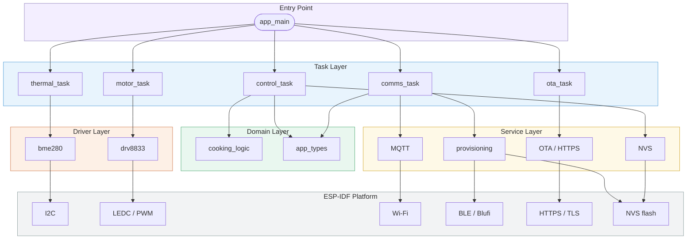
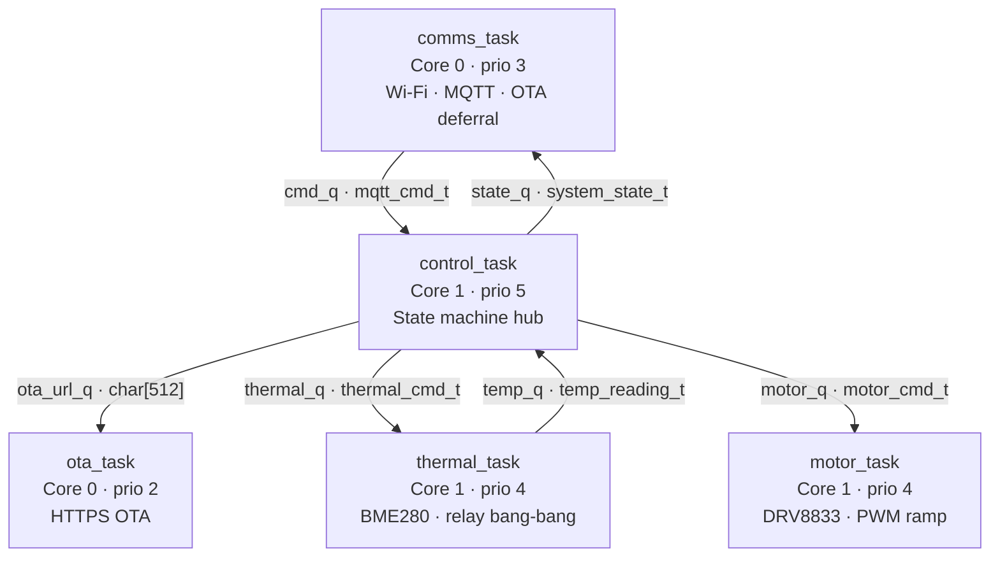
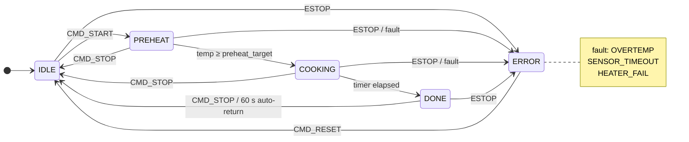
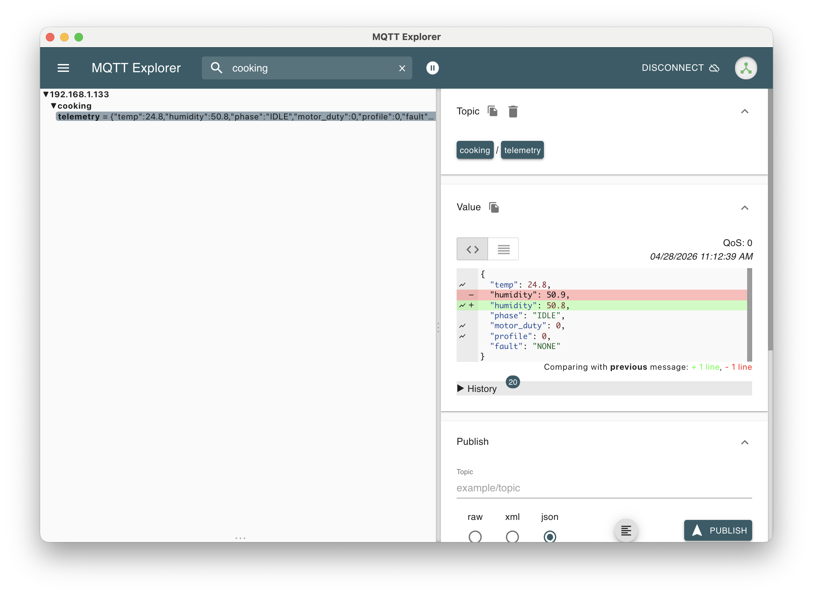
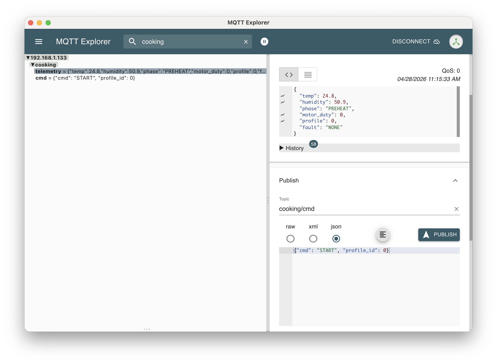
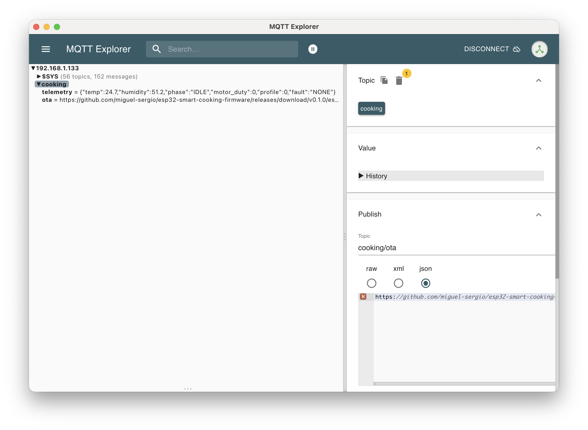
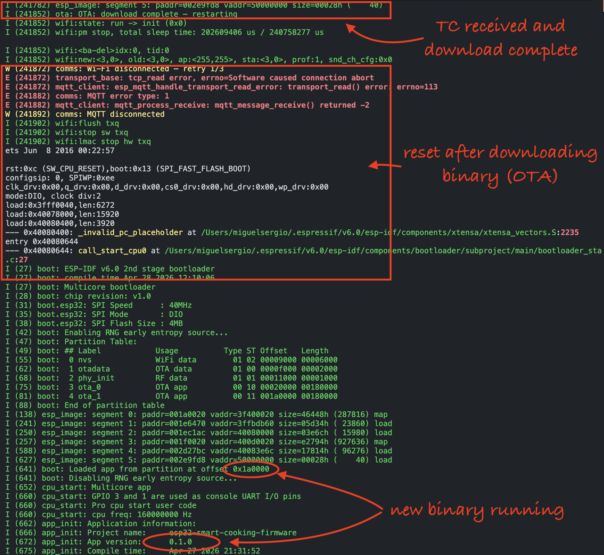
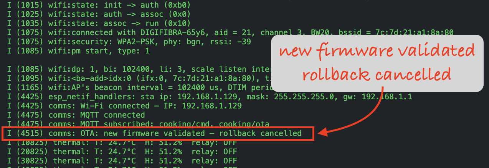
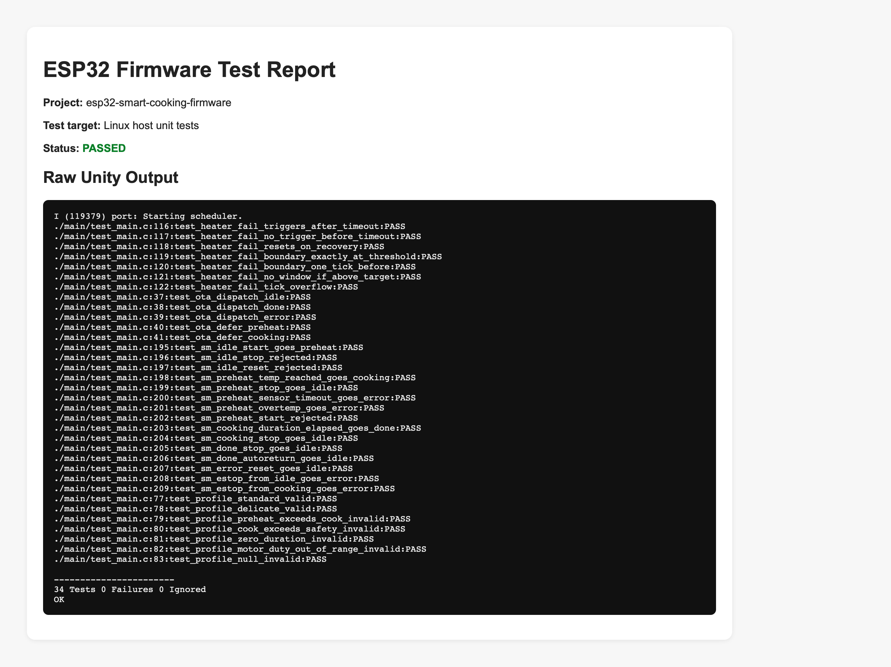

# ESP32 Smart Cooking Firmware

[](https://github.com/miguel-sergio/esp32-smart-cooking-firmware/actions/workflows/build.yml)
[](https://github.com/miguel-sergio/esp32-smart-cooking-firmware/actions/workflows/lint.yml)
[](https://github.com/miguel-sergio/esp32-smart-cooking-firmware/actions/workflows/test.yml)

Production-grade ESP32 firmware for a connected smart cooking appliance. The device controls a heating element and stirrer motor, monitors temperature and humidity in real time, and is operated remotely over MQTT. Built with [ESP-IDF v6.0](https://github.com/espressif/esp-idf).

This project was developed as a complete embedded firmware deliverable — from hardware bring-up and driver development through state machine design, wireless connectivity, OTA updates, and a full CI pipeline.


---

## Features

- **Thermal control** — Bang-bang relay controller with configurable setpoints, hysteresis, and safety cutoff. Sensor-timeout and heater-fail faults trip the system to a safe state automatically.
- **Motor control** — DRV8833 dual H-bridge driver with smooth PWM ramp-up/ramp-down and active brake on emergency stop.
- **MQTT connectivity** — Real-time telemetry (temperature, humidity, state, motor duty) published at 1 Hz during active cycles and 0.1 Hz at idle. Commands (`START`, `STOP`, `ESTOP`, `RESET`) received via a dedicated topic.
- **BLE provisioning** — First-boot Wi-Fi setup via Blufi with DH key exchange + AES-256-CTR encryption. BLE stack is fully torn down once credentials are saved. If Wi-Fi connection fails after 3 consecutive attempts, the device automatically re-enters provisioning mode — no physical intervention required.
- **OTA updates** — Firmware upgrades over HTTPS with TLS server verification triggered via MQTT. Updates are deferred until the cooking cycle is inactive; rollback activates automatically if the new firmware fails to connect.
- **Cooking profiles** — Two built-in profiles (Standard, Delicate) stored in NVS. Profiles are independently upgradeable over MQTT without a firmware rebuild.
- **Watchdog** — Task watchdog registered on all real-time tasks. `ota_task` is intentionally excluded (long download times are expected; a socket timeout guards against hangs instead).
- **Structured logging** — Every state transition, fault event, and command is logged via UART using ESP-IDF log levels (ERROR, WARN, INFO, DEBUG) with millisecond timestamps.

---

## Architecture

### Layered architecture

Dependencies flow strictly downward. The Domain layer has no knowledge of tasks, protocols, or hardware — this is what makes the state machine independently testable.



### Inter-task communication

Tasks never call each other directly. All data flow is explicit, unidirectional, and typed through FreeRTOS queues.

**Core assignment** — Core 1 is reserved exclusively for real-time control (`control_task`, `thermal_task`, `motor_task`), keeping actuator response deterministic and free from Wi-Fi stack interference. `comms_task` and `ota_task` run on Core 0, where the ESP-IDF Wi-Fi stack is pinned by design.

**Priority rationale** — `control_task` (prio 5) sits highest so it can preempt actuator tasks and dispatch state transitions without delay. `thermal_task` and `motor_task` share prio 4 — both are real-time loops that must preempt network I/O but yield to the state machine. `comms_task` (prio 3) tolerates the latency of MQTT publish intervals (1 Hz / 0.1 Hz). `ota_task` (prio 2) is intentionally the lowest: a background download must never starve any control path.



### State machine

- **Normal cycle** — `CMD_START` triggers preheating; once the target temperature is reached the cook timer starts; when it expires the system reaches `DONE` and returns to `IDLE` automatically after 60 s.
- **User abort** — `CMD_STOP` is accepted in `PREHEAT`, `COOKING`, and `DONE`, returning immediately to `IDLE` and disabling heater and motor.
- **Fault path** — `OVERTEMP`, `SENSOR_TIMEOUT`, or `HEATER_FAIL` detected during an active cycle drive the system to `ERROR`, cutting the heater and applying active brake on the motor. `CMD_RESET` is the only way out.
- **Emergency stop** — `ESTOP` is accepted in every state, including `IDLE` and `DONE`, and always transitions to `ERROR` regardless of what is running.



### Memory layout

Custom partition table for 4 MB flash. Two OTA slots of 1.5 MB each are required to fit the BLE + Blufi stack alongside the application firmware.

| Name | Type | Offset | Size | Notes |
|------|------|--------|------|-------|
| `nvs` | data | 0x9000 | 24 KB | Wi-Fi credentials, cooking profiles |
| `otadata` | data | 0xF000 | 8 KB | Active OTA slot selector |
| `phy_init` | data | 0x11000 | 4 KB | RF calibration data |
| `ota_0` | app | 0x20000 | 1.5 MB | OTA slot 0 |
| `ota_1` | app | 0x1A0000 | 1.5 MB | OTA slot 1 |

---

## Engineering Decisions

### Bang-bang thermal control
A simple on/off relay controller was chosen over PID for the initial prototype. It is robust, requires no tuning, and is straightforward to verify — critical properties when validating hardware for the first time. The known tradeoff is temperature overshoot around the setpoint. A PID controller is the natural next step once the hardware is characterised (see [Future Work](#future-work)).

### Pure state machine in `cooking_logic.c`
The core transition logic is isolated in a side-effect-free C module with no FreeRTOS or ESP-IDF calls. This allows the entire state machine — including all fault paths and edge cases — to be exercised with 34 unit tests across 4 test files on a Linux host, without hardware or a running RTOS. The tradeoff is a thin coordination layer in `control_task.c` that bridges the pure logic with the real-world queues and timers.

### BLE stack teardown after provisioning
Once Wi-Fi credentials are saved to NVS, the full BLE stack (Bluedroid + controller) is disabled and the RF coexistence resource is released. This eliminates BLE/Wi-Fi coexistence interference and reduces idle power consumption. The tradeoff is that re-provisioning requires a full restart, which is acceptable for a home appliance where credentials change rarely.

### `ota_task` excluded from the task watchdog
The ESP32 task watchdog is configured to a 5-second timeout. A firmware download over HTTPS can legitimately take 30–120 seconds on a slow connection, making WDT registration counterproductive — a mid-download reset is indistinguishable from a real hang. Instead, the HTTP socket timeout (30 s) acts as the hang guard: if the server stops responding, the socket errors out cleanly and the task waits for a corrected URL.

### Deferred OTA and Wi-Fi restart
Interruptive operations (OTA update, Wi-Fi max-retry recovery) are never executed while a cooking cycle is active. `comms_task` defers them until the state machine reaches IDLE, DONE, or ERROR. If a cycle is in progress when the trigger arrives, an ESTOP is posted first to drive the actuators to a defined safe state before any restart occurs. The tradeoff is added complexity in `comms_task`, but safety is non-negotiable for a heated appliance.

### Typed queues as the sole inter-task interface
Each task owns its own state exclusively. All data flow between tasks is explicit, unidirectional, and typed — there is no shared global state. This makes data flow auditable at a glance, eliminates a category of race conditions, and means each task can be reasoned about in isolation. The tradeoff is a small amount of boilerplate in queue definitions and config structs.

---

## Hardware

| Component | Part | Interface |
|-----------|------|-----------|
| MCU | ESP32-WROOM-32 (4 MB flash) | — |
| Temp/Humidity sensor | Bosch BME280 | I2C (400 kHz) |
| Motor driver | TI DRV8833 | LEDC PWM |
| Heating relay | — | GPIO |

**Pin map**

| Signal | GPIO |
|--------|------|
| I2C SDA | 21 |
| I2C SCL | 22 |
| Relay | 32 |
| DRV8833 AIN1 (PWM) | 25 |

### Photos

| BME280 | DRV8833 | Motor |
|--------|---------|-------|
|  |  |  |

| Relay | Motor power |
|-------|-------------|
|  |  |

---

## Project Structure

```
├── main/
│   ├── main.c              # app_main: queue creation, task launch
│   ├── control_task.c/.h   # State machine hub, NVS profile persistence
│   ├── thermal_task.c/.h   # BME280 read loop, relay bang-bang control
│   └── motor_task.c/.h     # DRV8833 ramp/stop/brake sequencing
│
├── components/
│   ├── app_types/          # Shared types, enums, and inline helpers
│   ├── bme280/             # BME280 I2C driver
│   ├── comms/              # Wi-Fi, MQTT, BLE provisioning, CLI task
│   ├── cooking_logic/      # Pure state-machine logic (host-testable)
│   ├── drv8833/            # DRV8833 LEDC/PWM driver
│   ├── ota/                # HTTPS OTA task
│   └── provisioning/       # Blufi provisioning + PSA Crypto security layer
│
└── test_apps/
    └── drivers/            # On-device hardware validation app (BME280 + DRV8833)
```

---

## Getting Started

**Requirements:** ESP-IDF v6.0, a supported ESP32 toolchain.

```bash
git clone https://github.com/miguel-sergio/esp32-smart-cooking-firmware.git
cd esp32-smart-cooking-firmware

# Set your MQTT broker URI
idf.py menuconfig
# → Smart Cooking App → MQTT Broker URI

# Build and flash
idf.py build flash monitor
```

On first boot the device enters BLE provisioning mode and advertises as `SmartCooking`. Use the ESP Blufi app (iOS/Android) to send Wi-Fi credentials. Credentials are saved to NVS; subsequent boots connect automatically.

---

## Demo

MQTT telemetry published at 1 Hz during an active cooking cycle (`cooking/telemetry`), and a command dispatched via `cooking/cmd`:





OTA update triggered via `cooking/ota`, followed by firmware validation and rollback cancellation, and the reset sequence:







---

## Testing

**Unit tests (Linux host — no hardware required)**

34 tests covering the full `cooking_logic` module run entirely on the host via ESP-IDF's Linux target — no board or emulator needed.

| File | Tests | Covers |
|------|------:|--------|
| `test_state_machine.c` | 15 | All state transitions, command rejection, fault paths |
| `test_heater_fail.c` | 7 | Consolidation window, timeout, recovery reset |
| `test_ota_dispatch.c` | 5 | Safe-state check for OTA / Wi-Fi restart |
| `test_profile.c` | 7 | Profile validation rules and boundary values |

```bash
cd test_apps/unity
idf.py --preview set-target linux
idf.py build
./build/unity_tests.elf
```



**Driver validation app (on-device)**

Validates the BME280 and DRV8833 drivers against live hardware. Reads 5 BME280 samples and checks they fall within the sensor's physical operating range; ramps DRV8833 Channel A through a speed sequence.

```bash
cd test_apps/drivers
idf.py build flash monitor
```

---

## CI

Every push and pull request runs three workflows:

| Workflow | What it checks |
|----------|----------------|
| **Build** | `idf.py build` for ESP32 target |
| **Lint** | `cppcheck` (exhaustive) + `clang-tidy` via Espressif's Xtensa-aware LLVM build |
| **Tests** | 34 host unit tests + driver test app build |

---

## Future Work

- **PID thermal control** — Replace the current bang-bang relay controller with a PID loop for tighter temperature regulation and elimination of overshoot, particularly relevant for the Delicate profile.
- **Touch display (LVGL)** — Local UI on a capacitive touch screen using LVGL, allowing full appliance control and live telemetry without MQTT. Targets SPI-connected panels (e.g. ILI9341).
- **CD pipeline for field updates** — Extend the existing CI with a release workflow that builds, signs, and publishes firmware binaries to a distribution endpoint on every tagged release, enabling automated over-the-air rollout to deployed devices via the existing MQTT OTA mechanism.
