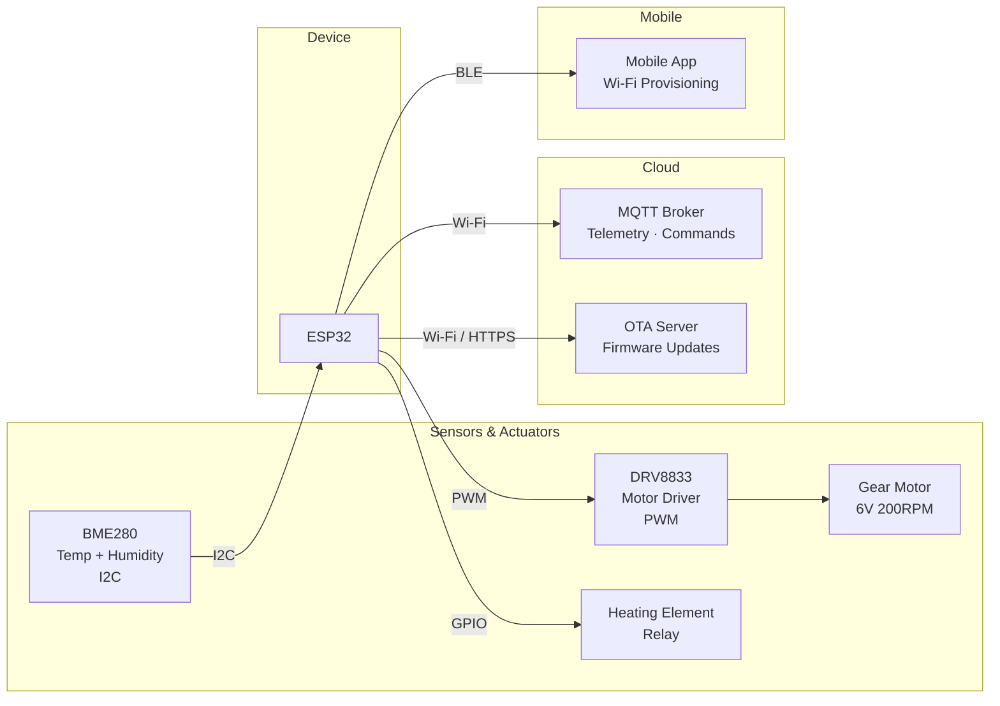
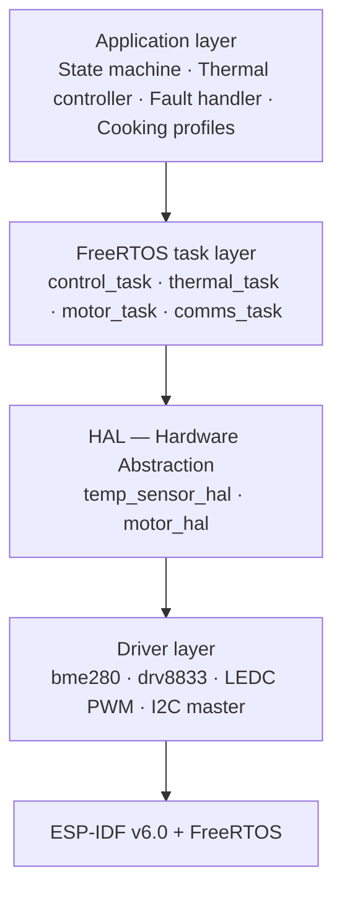
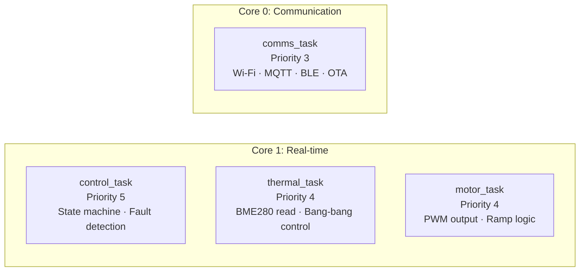
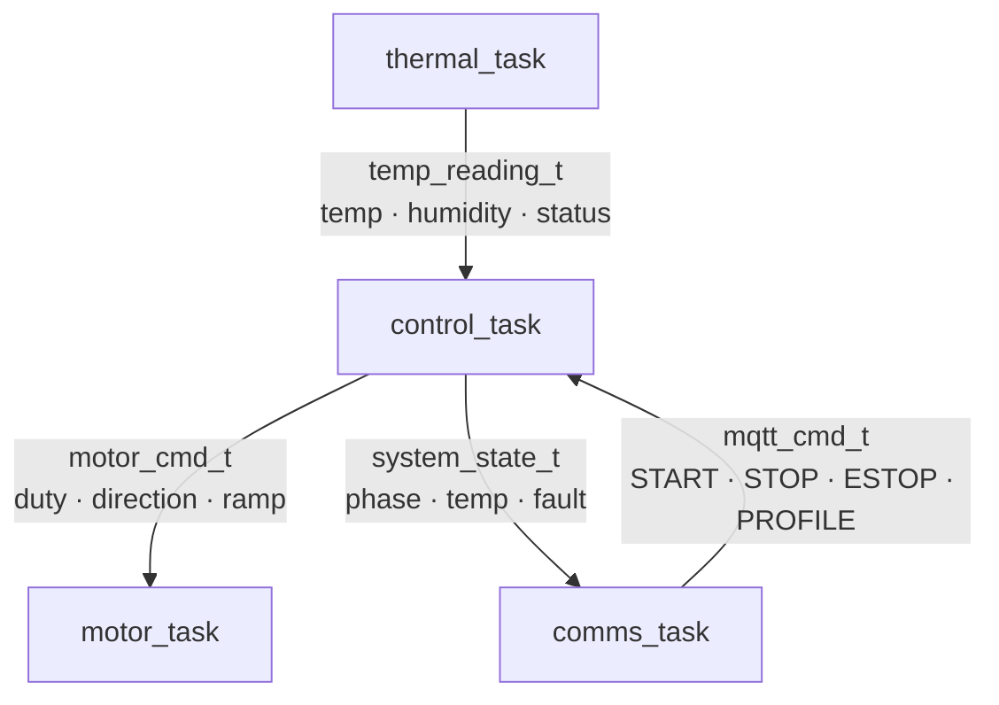
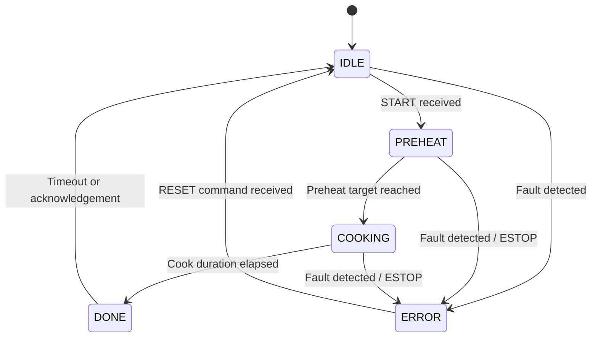
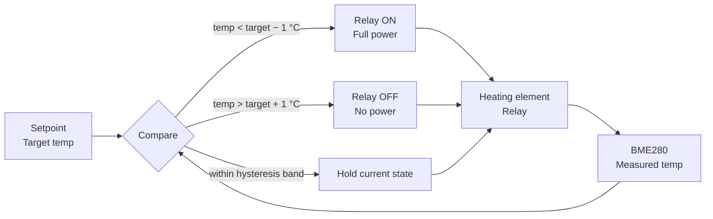
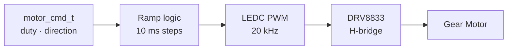
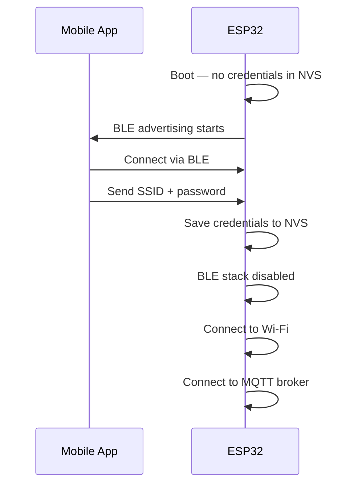
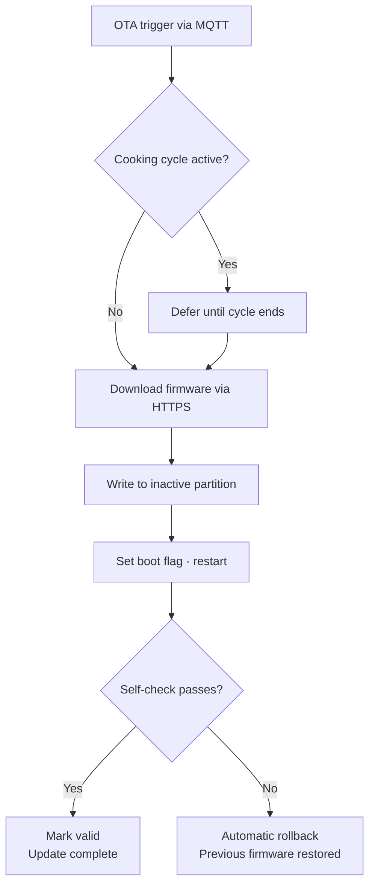
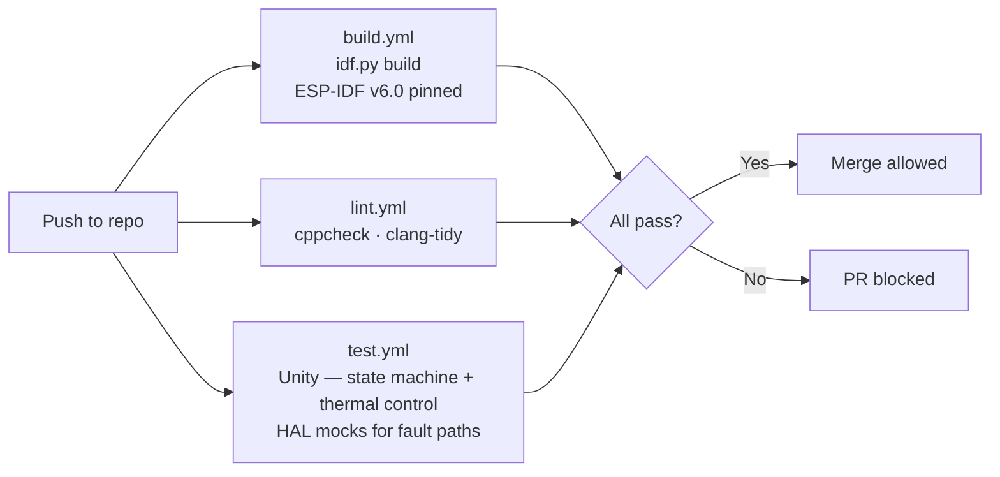

# System Design Document — ESP32 Smart Cooking Appliance Firmware
**Version:** 1.0  
**Status:** Released  
**References:** SRD_SmartCooking v1.0

---

## 1. Purpose

This document describes how the firmware will be built to satisfy every requirement in the SRD. Each design decision is traced back to one or more requirements. The goal is to give you a clear picture of the full product before the implementation is complete.

---

## 2. System overview

The ESP32 is the central controller. It reads the temperature sensor, drives the motor and heating element, and communicates with the outside world over Wi-Fi.

**Traces:** FR-02, FR-04, FR-07, FR-08, FR-09, FR-10

---

## 3. Software architecture

The firmware is organised in four layers. Each layer only communicates with the one directly below it. If hardware changes in the future, only the driver layer needs to be updated — the control logic stays untouched.

The HAL layer is what makes this design maintainable: the thermal controller asks the HAL for a temperature reading — it never touches I2C directly.

**Traces:** NFR-03

---

## 4. FreeRTOS tasks

Four tasks run concurrently. The real-time tasks are pinned to Core 1. The communication task runs on Core 0 so that Wi-Fi and MQTT never delay the control loop.

Tasks communicate through FreeRTOS queues — no shared memory, no race conditions.

**Traces:** NFR-01, NFR-02

---

## 5. Cooking state machine

The device follows a fixed sequence of phases. In ERROR, all actuators are disabled immediately. Recovery always requires an explicit RESET command — the device never exits ERROR on its own.

**Fault conditions:**

| Fault | Trigger |
|-------|---------|
| OVERTEMP | Temperature exceeds safety limit |
| SENSOR_TIMEOUT | No valid reading for more than 3 seconds |
| ESTOP | Emergency stop received via MQTT |
| Heater failure *(CR-001)* | Temperature remains more than 1 °C below the cooking target for 2 consecutive minutes at any point during the COOKING phase; the window resets if temperature recovers |

> **CR-001** — *Change request raised 2026-04-26.* A heater-failure fault condition was added to the fault detection subsystem. The state controller monitors temperature continuously during the COOKING phase using a sliding consolidation window: if the measured temperature stays more than 1 °C below the cooking target for 2 consecutive minutes, the system transitions to ERROR. A transient dip followed by recovery resets the window. Rationale: the fault must detect both a heater that never starts and one that fails or degrades mid-cycle.
**Traces:** FR-01, FR-05, NFR-01

---

## 6. Cooking profiles

Two profiles are stored in NVS and survive power cycles and firmware updates. The active profile is selected via MQTT command.

| Parameter | Profile 0 — Standard | Profile 1 — Delicate |
|-----------|----------------------|----------------------|
| Preheat target | 60 °C | 45 °C |
| Cook target | 80 °C | 60 °C |
| Safety cutoff | 95 °C | 75 °C |
| Cook duration | 30 min | 20 min |
| Motor duty | 60 % | 40 % |

**Traces:** FR-06

---

## 7. Thermal control — Bang-bang relay

A bang-bang (on/off) controller regulates the heating element to maintain target temperature. It runs at 1 Hz inside `thermal_task`. A ±1 °C hysteresis band prevents relay chatter around the setpoint.

**Hysteresis band:** ±1 °C around the active profile setpoint.

**Traces:** FR-03, NFR-01

---

## 8. Motor control

The motor speed always changes through a ramp — no abrupt starts or stops, except in ERROR and ESTOP where the motor cuts immediately.

| Transition | Ramp duration |
|------------|--------------|
| Start → cruise | 2 s |
| Cruise → stop | 1 s |
| ESTOP / ERROR | Immediate cut |

**Traces:** FR-04

---

## 9. Wi-Fi provisioning

On first boot, the device enters provisioning mode over BLE. Once the credentials are saved, BLE is shut down immediately to free memory and reduce RF interference. If Wi-Fi connection fails after 3 consecutive attempts on any subsequent boot, the firmware automatically re-enters BLE provisioning mode.

**Traces:** FR-07

---

## 10. MQTT topics

| Direction | Topic | Content | Rate |
|-----------|-------|---------|------|
| Publish | `cooking/telemetry` | Temp · humidity · phase · motor state · fault | 1 Hz active · 0.1 Hz idle |
| Publish | `cooking/fault` | Fault type · timestamp · last temperature | On fault |
| Subscribe | `cooking/cmd` | START / STOP / ESTOP / RESET + profile ID | — |
| Subscribe | `cooking/ota` | OTA trigger | — |

**Traces:** FR-08, FR-09

---

## 11. OTA firmware updates

An OTA update is deferred if a cooking cycle is active. The device uses two OTA partitions: if the new firmware fails its self-check on first boot, the previous version is restored automatically.

**Traces:** FR-10, NFR-05

---

## 12. NVS storage layout

All persistent data survives power cycles and firmware updates.

| Key | Type | Content |
|-----|------|---------|
| `wifi_ssid` | string | Provisioned Wi-Fi SSID |
| `wifi_pass` | string | Provisioned Wi-Fi password |
| `active_profile` | uint8 | Index of active cooking profile |
| `profile_0` | blob | Standard profile parameters |
| `profile_1` | blob | Delicate profile parameters |

**Traces:** FR-03, FR-06, FR-07

---

## 13. CI pipeline

Every push triggers three automated checks. A pull request cannot be merged to `main` unless all three pass.

**Traces:** NFR-06

---

## 14. Requirements traceability

Every requirement in the SRD is covered by at least one section in this document.

| Requirement | Section |
|-------------|---------|
| FR-01 Cooking cycle | §5 State machine |
| FR-02 Temperature monitoring | §4 Tasks, §3 HAL |
| FR-03 Thermal regulation | §7 Bang-bang relay |
| FR-04 Motor control | §8 Motor control |
| FR-05 Fault detection | §5 Fault table |
| FR-06 Cooking profiles | §6 Profiles, §12 NVS |
| FR-07 BLE provisioning | §9 Provisioning |
| FR-08 MQTT telemetry | §10 Topics |
| FR-09 MQTT control | §10 Topics |
| FR-10 OTA updates | §11 OTA |
| NFR-01 Reliability | §4 WDT, §5 Fault detection |
| NFR-02 Real-time | §4 Core assignment |
| NFR-03 Maintainability | §3 HAL layer |
| NFR-04 Observability | ESP-IDF structured logging on all tasks |
| NFR-05 Update safety | §11 OTA rollback |
| NFR-06 Code quality | §13 CI pipeline |

---

## 15. Future work

The following items are out of scope for v1.0 and deferred to future versions.

| Item | Rationale |
|------|-----------|
| PID thermal regulation | Requires characterisation of the heating element. Bang-bang with ±1 °C hysteresis is sufficient for v1.0. Replace §7 when implemented. |
| Live gain update via MQTT (`cooking/config`) | Depends on PID being implemented. |
| MOTOR_STALL detection | Requires a tachometer or current sensor absent from v1.0 hardware. |
